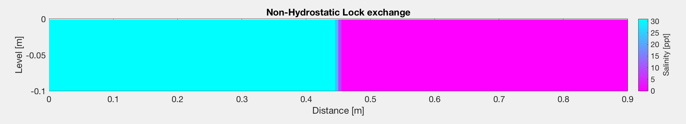
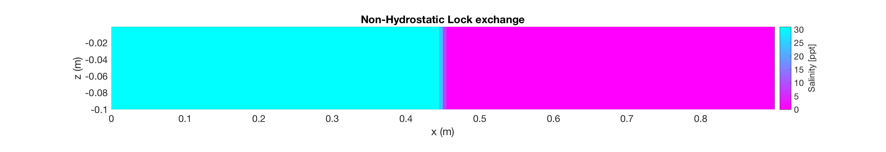
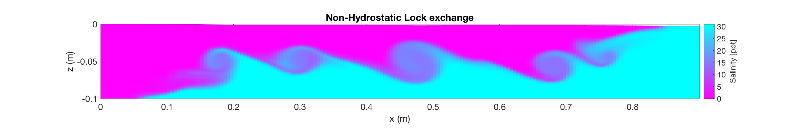

# Kelvin-Helmholtz Instabilities

This repository contains a SWASH model of a lock-exchange in which kelvin-Helmholtz instabilities are visualized. The physics of the Kelvin-Helmholtz instabilities are clearly explained over here: https://www.youtube.com/watch?v=qgamfo86FQo & https://www.youtube.com/watch?v=mf_143gkKSQ.

The constructed model is a non-hydrostatic RANS (Reynolds-Averaged-Navier-Stokes) model of a lock of 90cm long (horizontal grid size: 5mm) and a water depth of 10cm (vertical grid size: 1mm) in which the vertical velocity variations are resolved. The trade-off between the complexity of the equations and the restriction of the time-step has led to the conclusion that it is favourable to choose the explicit scheme over an (semi-)implicit scheme. The flow is initiated through a discrete baroclinic pressure gradient in which the saline water body has a salinity value of 31 ppt (density of 1023 kg/m3) and the fresh water body has no salinity concentration at all (density of 1000 kg/m3).

For the numerical approximations of the advection schemes of all the momentum equations the BDF scheme has been adopted including the energy head conservation in the horizontal direction. Since the salinity concentration is a conserved quantity a Flux-limiter (Minmod) has been applied to prevent unreal results (e.g. negative salinity concentration or larger salinity values w.r.t. beginning concentration). It must be noted that in this RANS model the turbulent fluctuations are not resolved but the average of the velocities and hence the Kelvin-Helmholtz instabilities that arise are the effect of the vertical velocity fluctuations on the average flow and not the the turbulent fluctuations themselves.

